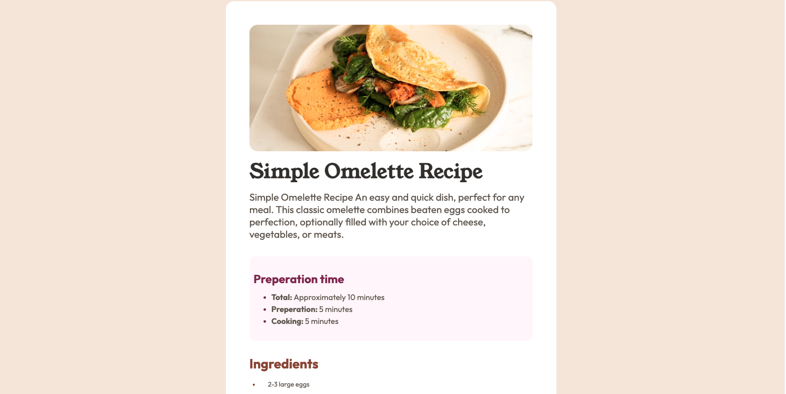

# Frontend Mentor - Recipe page solution

This is a solution to the [Recipe page challenge on Frontend Mentor](https://www.frontendmentor.io/challenges/recipe-page-KiTsR8QQKm). Frontend Mentor challenges help you improve your coding skills by building realistic projects.

## Table of contents

- [Overview](#overview)
  - [The challenge](#the-challenge)
  - [Screenshot](#screenshot)
  - [Links](#links)
- [My process](#my-process)
  - [Built with](#built-with)
  - [What I learned](#what-i-learned)
  - [Continued development](#continued-development)
  - [Useful resources](#useful-resources)
- [Author](#author)

## Overview

### Screenshot

### Links

- Solution URL: (https://www.frontendmentor.io/solutions/htmlcss-recipe-page-gqw1J9UenB)
- Live Site URL: (https://recipe-page-eight-sigma.vercel.app/)
- Gituhb Repo URL: (https://github.com/rzounlom/recipe-page)

## My process

### Built with

- Semantic HTML5 markup
- Flexbox
- Mobile-first workflow

### What I learned

- How to use .ttf files with css
- How to use css variables
- How to change ol/ul colors 

### Continued development

- Better workflow and design process before coding.
- More structured layout procees.

### Useful resources

- [How to reference .ttf](https://www.geeksforgeeks.org/how-to-include-a-font-ttf-using-css/) - This showed me how to reference the .ttf files in my stylesheet
- [CSS varables](https://elementor.com/blog/variables-in-css/?utm_source=google&utm_medium=cpc&utm_campaign=10759652828&utm_term=&lang=&gad_source=1&gclid=Cj0KCQjw2ou2BhCCARIsANAwM2G6OrJhY-17mmxPU5ziF3M3UvUko-dATsTeuxM0aHfo2dEGas8Re-YaAj9jEALw_wcB) - This showed me how to use CSS varialbes.
- [Change color of an li](https://www.w3schools.com/howto/howto_css_bullet_color.asp) - This showed me how to change the color of an li bullet/number
- [Responsively App](https://responsively.app/download) - This app makes it easy to view multiple device layouts at once.

## Author

- Github - [Romaric Zounlome](https://github.com/ZounMedia)
- Frontend Mentor - [@rzounlom](https://www.frontendmentor.io/profile/rzounlom)
