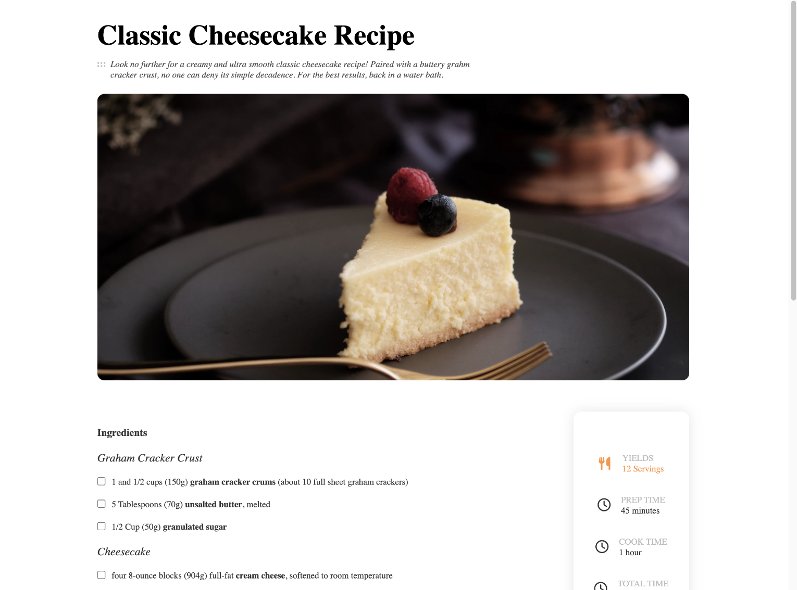

<!-- Please update value in the {}  -->

<h1 align="center">{Your project name}</h1>

   Solution for a challenge from  <a href="http://devchallenges.io" target="_blank">Devchallenges.io</a>.

  <h3>
    <a href="https://rzounlom.github.io/recipe-page/">
      Demo
    </a>
     | 
    <a href="https://github.com/rzounlom/recipe-page">
      Solution
    </a>
     | 
    <a href="https://devchallenges.io/challenges/OEKdUZ6xs0h99C38XVht">
      Challenge
    </a>
  </h3>

<!-- TABLE OF CONTENTS -->

## Table of Contents

- [Overview](#overview)

<!-- OVERVIEW -->

## Overview

- devChallenges.io Recipe Page challenge
- It was nice to take a step back and get back to the fundamentals of HTML and CSS
- I learned that it's always good to practice the fundamentals
- Thoughts: take your time and just keep building things!

## Contact

- GitHub [@rzounlom](https://github.com/rzounlom)
